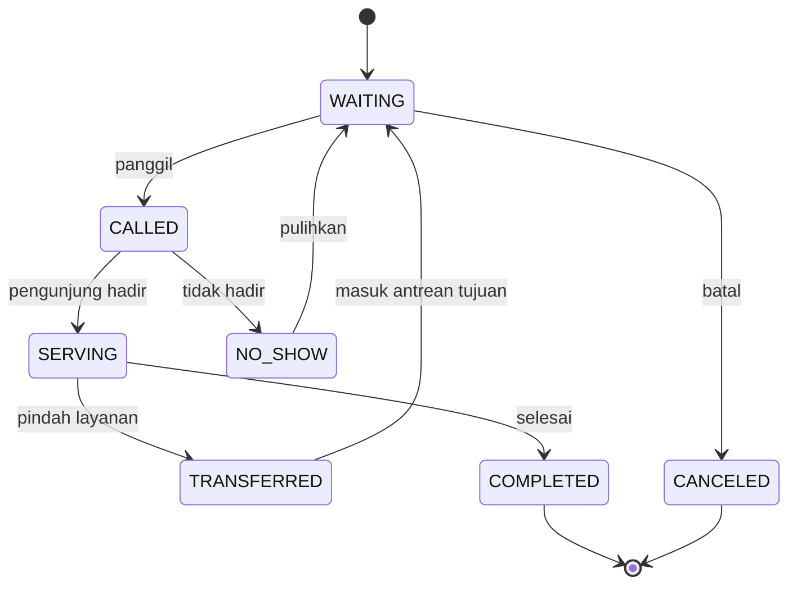
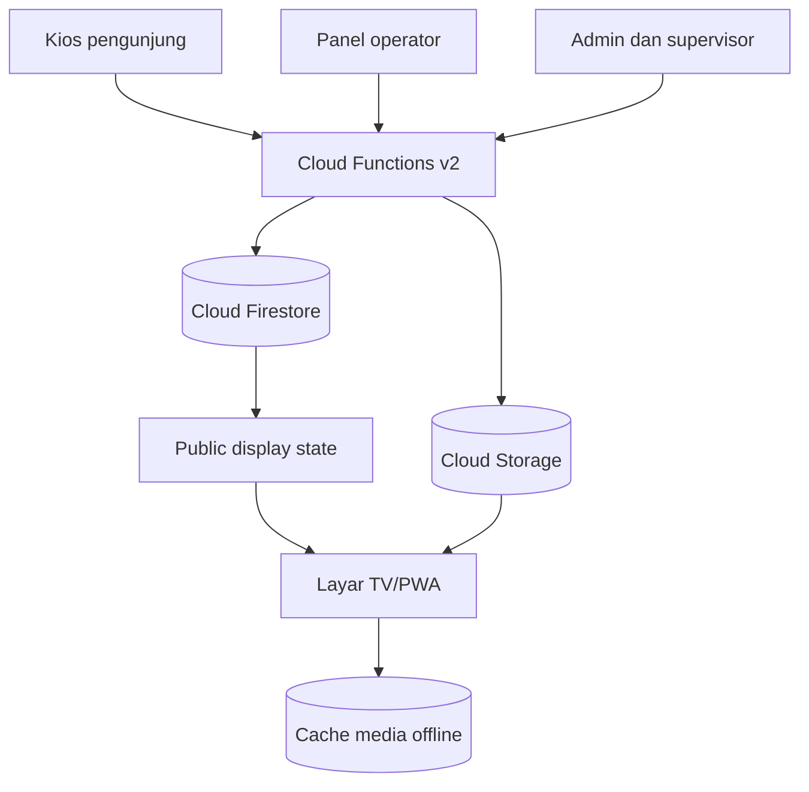

# Arahan Developer Aplikasi Sistem Antrean DPPKB Kabupaten Majene

**Nama kerja:** Sistem Antrean Pelayanan Keluarga Berencana dan Pelayanan Sekretariat  
**Platform:** Web/PWA berbasis Firebase  
**Target lokasi:** Dinas Pengendalian Penduduk dan Keluarga Berencana (DPPKB) Kabupaten Majene  
**Tanggal kajian:** 3 Agustus 2026 (WITA)

---

## 1. Ringkasan keputusan produk

Bangun satu sistem web dengan empat antarmuka yang memakai sumber data yang sama:

1. **Kios pengambilan antrean** untuk pengunjung di kantor.
2. **Panel operator loket** untuk memanggil dan memproses antrean.
3. **Layar informasi TV** untuk menampilkan nomor yang dipanggil, daftar panggilan berikutnya, informasi layanan, dan video program.
4. **Panel admin/supervisor** untuk mengatur layanan, loket, petugas, jam operasional, playlist video, pengumuman, dan laporan.

MVP memakai dua kelompok antrean yang mudah dikenali:

- `KB-001`, `KB-002`, dan seterusnya: **Pelayanan Keluarga Berencana**.
- `SK-001`, `SK-002`, dan seterusnya: **Pelayanan Sekretariat**.

Jenis layanan di bawah kedua kelompok tersebut **harus berupa master data yang dapat diubah admin**, bukan teks yang ditanam di kode. Daftar resmi, persyaratan, SLA, tarif, dan loket penanggung jawab baru boleh dipublikasikan setelah disamakan dengan SOP dan Standar Pelayanan DPPKB Majene.

Sistem antrean hanya menyimpan data operasional minimal. Jangan menyimpan nama lengkap, NIK, diagnosis/keluhan, pilihan alat kontrasepsi, atau data kesehatan lain kecuali ada kebutuhan resmi, dasar pemrosesan, penilaian risiko, kontrol akses, dan persetujuan tertulis. Data kesehatan termasuk data pribadi spesifik dalam [UU No. 27 Tahun 2022 tentang Pelindungan Data Pribadi](https://peraturan.bpk.go.id/Details/229798/uu-no-27-tahun-2022).

---

## 2. Hasil analisis aplikasi antrean pelayanan pemerintah

### 2.1 Pola yang perlu ditiru

Benchmark pelayanan publik menunjukkan bahwa antrean bukan sekadar tombol “ambil nomor”. Sistem yang baik menghubungkan pilihan fasilitas/layanan, tanggal atau jadwal, nomor antrean, status pelayanan, dan informasi yang transparan. Pola pemilihan fasilitas, poli, tanggal, dan jadwal dapat dilihat pada [panduan antrean Mobile JKN BPJS Kesehatan](https://bpjs-kesehatan.go.id/user-manual-mobile-jkn/pelayanan%20jkn.html).

Untuk konteks pelayanan pemerintah, layar dan kios juga harus menerangkan Standar Pelayanan: persyaratan, mekanisme/prosedur, waktu penyelesaian, biaya/tarif, produk layanan, dan kanal pengaduan. Enam komponen ini diwajibkan dalam [PermenPANRB No. 15 Tahun 2014](https://peraturan.bpk.go.id/Download/123519/PERMENPAN%20NOMOR%2015%20TAHUN%202014.pdf), selaras dengan kerangka [UU No. 25 Tahun 2009 tentang Pelayanan Publik](https://peraturan.bpk.go.id/Details/38748/uu-no-25-tahun-2009).

### 2.2 Prinsip desain layanan

| Prinsip | Implikasi ke aplikasi |
|---|---|
| Sederhana | Pengunjung memilih maksimal 2–3 langkah: kelompok layanan → jenis layanan → konfirmasi. |
| Transparan | Tampilkan status loket, jumlah yang menunggu, estimasi wajar, persyaratan, biaya resmi, dan kanal pengaduan. |
| Adil | FIFO sebagai dasar; prioritas hanya menurut SOP dan direkam alasannya. Transfer tidak menghapus waktu kedatangan awal. |
| Inklusif | Tombol besar, kontras tinggi, navigasi keyboard/touch, opsi bantuan petugas, serta kebijakan untuk lansia, penyandang disabilitas, ibu hamil, dan kelompok prioritas lain. |
| Privat | TV hanya menampilkan kode antrean dan loket, bukan nama, NIK, nomor telepon, keluhan, atau jenis tindakan medis. |
| Dapat diaudit | Setiap ambil nomor, panggil, panggil ulang, mulai, transfer, selesai, batal, dan no-show menghasilkan event dengan waktu dan pelaku. |
| Tahan gangguan | App shell dan media wajib tetap tampil saat jaringan putus; operasi nomor yang butuh transaksi berhenti secara aman dan menampilkan SOP manual. |

### 2.3 Konteks program DPPKB Majene

Konten layanan dan video sebaiknya berpusat pada kebutuhan nyata di Majene: akses pelayanan kontrasepsi, penyuluhan/KIE Bangga Kencana, konseling keluarga, kesehatan reproduksi, pencegahan stunting, serta program keluarga berkualitas. Aktivitas resmi terkini di Majene mencakup penguatan akses pelayanan KB dan edukasi di wilayah kecamatan, seperti [pelayanan KB di Balai KB Malunda](https://sulbar.kemendukbangga.go.id/posts/33e5af1b-ee52-430f-be94-9d5fb0a9a5d8-balai-kb-malunda-gelar-pantau-kb-guna-tekan-unmet-need-di-majene) dan [pelayanan KB keliling di Sendana](https://sulbar.kemendukbangga.go.id/posts/6ab7ed5e-384c-4887-8609-5b1630166b33-dekatkan-layanan-ke-masyarakat-penyuluh-kb-sendana-gelar-pelayanan-kb-keliling-di-desa-limboro-rambu-rambu). Ini menjadi dasar tema konten, bukan dasar untuk mengarang jenis layanan kantor.

---

## 3. Sasaran dan batasan MVP

### Sasaran

- Mengurangi antrean tidak teratur dan panggilan manual.
- Memberi kepastian status dan urutan kepada pengunjung.
- Membantu petugas mengelola dua kelompok layanan dari satu panel.
- Menjadikan masa tunggu sebagai ruang edukasi program yang relevan.
- Menghasilkan data waktu tunggu dan durasi pelayanan untuk perbaikan SOP.
- Tampil profesional pada TV LED/monitor 16:9 tanpa scroll atau elemen terpotong.

### Di dalam MVP

- Antrean kunjungan langsung di satu kantor/lokasi.
- Dua kelompok layanan dan sublayanan yang dapat dikonfigurasi.
- Kios, operator, display TV, admin, supervisor, dan laporan dasar.
- Panggilan visual dan suara.
- Playlist campuran: MP4 resmi yang tersimpan lokal/offline, MP4 online dari Cloud Storage, dan tautan online yang disetujui.
- PWA/app shell, status koneksi, sinkronisasi media offline, log aktivitas, dan ekspor CSV.

### Di luar MVP; masuk fase berikutnya

- Reservasi antrean dari rumah/WhatsApp.
- Integrasi Dukcapil, SatuSehat, SIGA, Elsimil, tanda tangan elektronik, atau aplikasi lain.
- Rekam medis, konseling klinis, dan pencatatan alat/obat kontrasepsi.
- Pembayaran, pengiriman SMS/WhatsApp, dan aplikasi mobile native.
- Operasi antrean penuh melalui LAN tanpa internet. Firebase cloud tidak otomatis menjadi server lokal.

---

## 4. Peran pengguna dan hak akses

| Peran | Hak utama |
|---|---|
| Pengunjung | Melihat layanan publik dan mengambil satu nomor antrean dari kios. |
| Petugas bantuan | Mengambilkan nomor, menandai kebutuhan prioritas sesuai SOP, dan mencetak ulang tiket. |
| Operator | Buka/tutup loket, panggil berikutnya, panggil ulang, mulai layanan, transfer, selesai, batal/no-show, tambah catatan operasional nonmedis. |
| Supervisor | Memantau seluruh loket, memindahkan antrean, membuka/menutup layanan, mengoreksi status dengan alasan, melihat laporan. |
| Admin konten | Mengelola video, playlist, pengumuman, persyaratan, dan informasi layanan; tidak mengelola akun atau data audit. |
| Admin sistem | Mengelola akun, peran, lokasi, layanan, loket, konfigurasi, retensi, dan integrasi. |
| Display TV | Akun/perangkat khusus dengan akses baca hanya ke data publik yang sudah disanitasi. |

Gunakan Firebase Authentication dan **role-based access control** melalui custom claims; kemampuan ini didukung resmi oleh [Firebase Custom Claims dan Security Rules](https://firebase.google.com/docs/auth/admin/custom-claims). Jangan hanya menyembunyikan tombol di UI—otorisasi wajib ditegakkan di backend dan Security Rules.

---

## 5. Alur pelayanan

### 5.1 Alur pengunjung di kios

1. Layar awal menampilkan dua tombol besar: **Pelayanan KB** dan **Pelayanan Sekretariat**.
2. Pengunjung memilih jenis layanan dari master yang aktif.
3. Sistem menampilkan ringkasan persyaratan, tarif resmi (“Gratis” bila memang ditetapkan), estimasi, dan loket tujuan.
4. Pengunjung memilih **Ambil Nomor**.
5. Cloud Function membuat nomor secara atomik dan mengembalikan tiket.
6. Tiket menampilkan kode, waktu, kelompok layanan, jumlah antrean di depan, QR/token publik opsional, dan instruksi menunggu.
7. Jika printer tersedia, cetak tiket 80 mm; selalu sediakan tampilan ulang tanpa mewajibkan printer.

Kios harus menolak klik ganda, memakai idempotency key, dan memberi jeda/rate limit. Satu pengunjung tidak boleh menghasilkan dua tiket akibat tombol ditekan berulang atau respons lambat.

### 5.2 Alur operator

1. Operator login dan memilih loket serta kelompok layanan yang ditangani.
2. Operator menekan **Panggil Berikutnya**.
3. Backend mengunci dan memilih tiket sah berikutnya, mengubah status menjadi `CALLED`, dan membuat event panggilan.
4. TV menerima perubahan real-time, menampilkan overlay besar, membunyikan chime, lalu mengucapkan: “Nomor antrean KB nol nol satu, silakan menuju Loket Satu.”
5. Operator memilih **Mulai Pelayanan** saat pengunjung hadir.
6. Operator menyelesaikan, mentransfer, membatalkan, atau menandai no-show.

### 5.3 Aturan antrean

- Urutan dasar: `createdAt` paling lama lebih dahulu.
- Kebijakan prioritas dibuat sebagai konfigurasi dan wajib merujuk SOP tertulis; jangan ditentukan developer.
- Tiket transfer mempertahankan `originalCreatedAt` agar pengunjung tidak kembali ke urutan paling belakang tanpa alasan.
- Panggil ulang maksimal dua kali dengan jeda yang dapat diatur, lalu operator dapat menandai no-show.
- Pemulihan no-show hanya oleh operator/supervisor dengan alasan dan batas waktu konfigurabel.
- Satu operator tidak dapat memproses dua tiket aktif sekaligus kecuali supervisor melakukan override.
- Satu tiket hanya dapat dimiliki satu loket pada satu waktu.
- Nomor dimulai ulang per tanggal lokal `Asia/Makassar`, per lokasi, dan per kelompok layanan.
- Pergantian hari tidak memakai reset massal; tanggal menjadi bagian dari ID sequence agar aman.

### 5.4 State machine tiket



Semua transisi divalidasi backend. Klien tidak boleh menulis status sembarang.

---

## 6. Spesifikasi layar TV/monitor

### 6.1 Komposisi 16:9

Target desain utama: 1920×1080; harus tetap tajam dan proporsional pada 1366×768 serta 3840×2160.

| Area | Proporsi | Isi |
|---|---:|---|
| Header | 8–10% tinggi | Lambang/identitas resmi, nama dinas, hari/tanggal/jam WITA, status koneksi. |
| Konten kiri | 58–62% lebar | Video 16:9 dengan `object-fit: contain`, judul singkat, indikator offline/online hanya bila berguna. |
| Konten kanan | 38–42% lebar | Nomor saat ini, loket, kelompok layanan, 3–5 panggilan terakhir/berikutnya. |
| Footer | 9–12% tinggi | Kartu pengumuman statis bergilir, status layanan, kanal pengaduan/QR resmi. |

Saat ada panggilan, tampilkan overlay fokus selama 8–12 detik:

- Nomor antrean sangat besar (rekomendasi CSS `clamp(96px, 10vw, 190px)`).
- Loket minimal 56 px pada 1080p.
- Chime satu kali, pengumuman suara dua kali, lalu overlay mengecil ke panel kanan.
- Volume video diturunkan ke 10–20% atau video dijeda; lanjutkan dari posisi sebelumnya setelah panggilan.
- Jika dua panggilan datang berdekatan, masukkan ke event queue dan putar berurutan—jangan saling memotong.

### 6.2 Arah visual

- Gaya: **civic modern**—bersih, resmi, hangat, informatif.
- Palet awal: navy gelap untuk otoritas, biru/teal untuk layanan, aksen emas untuk panggilan, putih/off-white untuk keterbacaan. Finalisasi setelah logo dan pedoman identitas resmi diterima.
- Gunakan font sans-serif yang jelas, angka tabular, bobot medium/bold, dan maksimal dua keluarga font.
- Safe area minimal 3% dari semua tepi untuk mengantisipasi overscan TV.
- Tidak ada scroll, pop-up browser, kontrol video yang menutupi antrean, marquee panjang, efek berkedip, atau animasi dekoratif berlebihan.
- Gunakan kartu pengumuman yang berganti dengan cross-fade, bukan teks berjalan terus-menerus. WCAG mensyaratkan mekanisme pause/stop/hide untuk konten bergerak otomatis yang berlangsung lebih dari lima detik; lihat [WCAG 2.2 Quick Reference](https://www.w3.org/WAI/WCAG22/quickref/).
- Target kontras minimal WCAG 2.2 AA. Informasi tidak boleh dibedakan hanya berdasarkan warna.

### 6.3 Kondisi layar yang wajib didesain

- Layanan normal dan ada antrean.
- Belum ada antrean.
- Salah satu kelompok layanan tutup.
- Semua layanan tutup.
- Loket sedang istirahat.
- Jaringan putus tetapi video offline tetap berjalan.
- Sinkronisasi tertunda.
- Video gagal diputar; sistem lompat ke video berikutnya.
- Jam pelayanan berakhir; tampilkan jam buka berikutnya dan informasi resmi.

---

## 7. Sistem video offline dan online

### 7.1 Sumber media

| Jenis | Implementasi | Perilaku saat offline |
|---|---|---|
| MP4 offline wajib | Admin mengunggah MP4 berizin, perangkat display mengunduh dan menyimpan salinan lokal melalui PWA storage. | Tetap diputar. |
| MP4 Cloud Storage | File disimpan di bucket terkontrol dan di-stream saat online. | Diputar hanya jika sudah di-cache; jika belum, dilewati. |
| YouTube/tautan resmi | Embed hanya dari kanal resmi/daftar domain yang disetujui. | Dilewati; tidak boleh “diunduh” oleh aplikasi. |

Untuk layar pemerintahan, prioritaskan MP4 resmi tanpa iklan sebagai playlist utama. YouTube adalah sumber online opsional karena membutuhkan koneksi, dapat menampilkan UI pihak ketiga, dan kebijakan autoplay dapat berubah. Offline file harus berasal dari pemilik konten atau file yang hak pemutarannya telah disetujui.

### 7.2 Manajemen playlist

Setiap item media memiliki:

- judul, deskripsi singkat, sumber/pemilik, dan URL sumber asli;
- `sourceType`, durasi, ukuran, resolusi, MIME type, checksum;
- tanggal mulai/akhir publikasi;
- kelompok sasaran dan kategori program;
- status aktif, urutan/bobot, `offlineRequired`;
- bukti/keterangan hak penggunaan;
- subtitle/caption bila tersedia;
- waktu sinkronisasi dan status cache per perangkat display.

Panel display setup harus memiliki tombol **Sinkronkan Media Offline**, progress per file, kapasitas tersedia, checksum verification, “test playback”, dan indikator minimal dua video offline siap sebelum mode display boleh diaktifkan.

### 7.3 Strategi offline

- Cache app shell, logo, font lokal, chime, dan fallback graphics dengan service worker.
- Simpan metadata playlist di IndexedDB; simpan media besar di Cache Storage atau OPFS berdasarkan hasil uji perangkat.
- Panggil `navigator.storage.estimate()` sebelum mengunduh dan minta persistent storage bila browser mendukung.
- Hapus file lama dengan kebijakan LRU hanya setelah pengganti selesai dan checksum valid.
- Selalu sisakan satu playlist darurat yang tertanam/terunduh.
- Cache browser dapat dihapus oleh browser/OS; [MDN menjelaskan kuota dan kemungkinan eviction](https://developer.mozilla.org/en-US/docs/Web/API/Storage_API/Storage_quotas_and_eviction_criteria). Karena itu perangkat display harus dikelola, ruang disk dipantau, dan status cache diaudit setiap hari.

Jika uji pada smart TV gagal mempertahankan media besar, gunakan mini PC/Android box yang dikelola dan browser Chrome/Edge mode kiosk. Jangan bergantung pada browser bawaan TV yang tidak jelas dukungan PWA/storage-nya.

### 7.4 Autoplay dan audio panggilan

Chrome dapat memblokir autoplay bersuara tanpa interaksi pengguna; lihat [kebijakan autoplay Chrome](https://developer.chrome.com/blog/autoplay). Sediakan layar awal **Mulai Layar Antrian** yang ditekan petugas setelah perangkat menyala untuk membuka fullscreen dan audio. Video dapat mulai dalam keadaan muted, tetapi pengumuman antrean harus diuji pada perangkat final.

Untuk suara panggilan, prioritaskan salah satu solusi yang telah diuji offline:

1. engine TTS Bahasa Indonesia yang terpasang pada OS perangkat; atau
2. audio lokal tersusun dari potongan frasa dan angka.

Jangan mengandalkan layanan TTS internet untuk fungsi inti. Sediakan replay manual dan fallback visual bila suara gagal.

### 7.5 Tema video yang disarankan

- Cara memilih dan mengakses layanan KB secara aman dan sukarela.
- Informasi metode kontrasepsi yang seimbang dan mengarahkan konsultasi ke tenaga kompeten.
- Kesehatan reproduksi dan perencanaan keluarga.
- 1.000 Hari Pertama Kehidupan dan pencegahan stunting.
- Ketahanan/kualitas keluarga, pengasuhan, dan Kampung Keluarga Berkualitas.
- Generasi Berencana dan pencegahan perkawinan anak.
- Informasi layanan lapangan DPPKB Majene, jadwal kegiatan, persyaratan, dan kanal pengaduan.

Semua konten kesehatan harus direviu pejabat/tenaga kompeten dan admin hanya mempublikasikan materi yang telah disetujui.

---

## 8. Arsitektur teknis Firebase

### 8.1 Stack yang direkomendasikan

- Frontend: TypeScript + React + Vite, responsive CSS, PWA/service worker.
- Hosting: Firebase Hosting dengan domain resmi pemerintah bila disetujui.
- Database: Cloud Firestore Standard Edition.
- Backend tepercaya: Cloud Functions for Firebase v2, callable/HTTPS.
- Identitas: Firebase Authentication.
- Media: Cloud Storage for Firebase.
- Proteksi aplikasi: Firebase App Check.
- Observability: Cloud Logging, error tracking, dan dashboard penggunaan/biaya.
- Testing: Firebase Local Emulator Suite + unit/integration/end-to-end tests.

Firestore snapshot listeners mendukung pembaruan real-time untuk panel operator dan TV; lihat [dokumentasi listener Firestore](https://firebase.google.com/docs/firestore/query-data/listen). Firestore juga memiliki cache offline, tetapi cache bukan pengganti backend lokal; [transaksi gagal ketika klien offline](https://firebase.google.com/docs/firestore/manage-data/transactions). Karena urutan antrean membutuhkan transaksi, pengambilan nomor dan “panggil berikutnya” wajib melalui Cloud Function dan harus berhenti secara aman ketika koneksi hilang.

### 8.2 Diagram komponen



Klien publik tidak boleh menulis langsung ke dokumen sequence/ticket. Function menjalankan validasi, transaksi, idempotency, role check, audit event, dan pembentukan `publicDisplayState` yang tidak berisi data privat.

### 8.3 Lokasi resource

Saat membuat project, pilih resource regional Jakarta `asia-southeast2` untuk Firestore dan Functions bila kebijakan pemerintah daerah mengizinkan; kedua layanan mendukung Jakarta menurut [daftar lokasi Firestore](https://firebase.google.com/docs/firestore/locations) dan [daftar lokasi Cloud Functions](https://firebase.google.com/docs/functions/locations). Lokasi database tidak dapat diubah setelah dibuat. Lokasi Cloud Storage harus dipilih dan diverifikasi terpisah.

Penggunaan Firebase untuk sistem instansi pemerintah harus lebih dulu direviu oleh Diskominfo/SPBE, bagian hukum, pengelola keamanan informasi, dan pejabat/petugas fungsi pelindungan data. Pemilihan region Jakarta saja **tidak otomatis berarti seluruh kepatuhan terpenuhi**. Sistem wajib diselaraskan dengan [Perpres No. 95 Tahun 2018 tentang SPBE](https://peraturan.bpk.go.id/Details/96913/perpres-no-95-tahun-2018), integrasi/interoperabilitas dalam [Perpres No. 82 Tahun 2023](https://peraturan.bpk.go.id/Details/273981/perpres-no-82-tahun-2023), serta keberlangsungan layanan yang diwajibkan [PP No. 71 Tahun 2019](https://peraturan.bpk.go.id/Details/122030/pp-no-71-tahun-2019).

### 8.4 Model data konseptual

```text
organizations/{orgId}
sites/{siteId}
services/{serviceId}
counters/{counterId}
users/{uid}
devices/{deviceId}
days/{yyyy-mm-dd}
days/{date}/sequences/{serviceGroup}
days/{date}/tickets/{ticketId}
days/{date}/events/{eventId}
days/{date}/publicState/{siteId}
media/{mediaId}
playlists/{playlistId}
announcements/{announcementId}
dailyMetrics/{date_serviceId}
systemSettings/{settingId}
```

Field inti tiket:

```ts
type TicketStatus =
  | 'WAITING' | 'CALLED' | 'SERVING' | 'TRANSFERRED'
  | 'COMPLETED' | 'NO_SHOW' | 'CANCELED';

interface Ticket {
  id: string;
  code: string;             // KB-001 / SK-001
  sequence: number;
  siteId: string;
  serviceGroup: 'KB' | 'SK';
  serviceId: string;
  status: TicketStatus;
  priorityClass: string;    // nilai terkontrol, tidak tampil di TV
  source: 'KIOSK' | 'ASSISTED' | 'REMOTE';
  originalCreatedAt: Timestamp;
  createdAt: Timestamp;
  calledAt?: Timestamp;
  serviceStartedAt?: Timestamp;
  completedAt?: Timestamp;
  counterId?: string;
  operatorId?: string;
  callCount: number;
  version: number;
  idempotencyKey: string;
}
```

Data privat opsional—jika di kemudian hari benar-benar diperlukan—ditempatkan di koleksi terpisah dengan Rules lebih ketat, retensi lebih pendek, dan tidak pernah disalin ke `publicState`.

### 8.5 Command backend wajib

- `issueTicket()`
- `openCounter()` / `closeCounter()`
- `callNext()`
- `recallTicket()`
- `startService()`
- `transferTicket()`
- `completeTicket()`
- `markNoShow()`
- `cancelTicket()`
- `restoreTicket()`
- `publishDisplayState()`
- `aggregateDailyMetrics()`
- `purgeExpiredOperationalData()`
- `syncMediaManifest()`

Setiap command menerima `requestId`/idempotency key dan mengembalikan hasil yang sama ketika permintaan identik diulang. `issueTicket()` serta `callNext()` menggunakan transaksi atomik. Cloud Firestore mendukung operasi atomik dan retry saat konflik; lihat [dokumentasi transaksi Firestore](https://firebase.google.com/docs/firestore/manage-data/transactions).

---

## 9. Keamanan, privasi, dan tata kelola

### 9.1 Aturan minimum

- Default-deny pada Firestore dan Storage Rules.
- Semua mutasi kritis melalui Cloud Functions; client tidak menulis sequence, status, role, audit, atau metrik.
- Custom claims untuk peran dan `siteId`; token diperbarui setelah perubahan role.
- App Check diaktifkan pada web app dan fungsi untuk mengurangi penyalahgunaan; fungsinya dijelaskan dalam [dokumentasi Firebase App Check](https://firebase.google.com/docs/app-check).
- Admin menggunakan akun individual, bukan akun bersama. Terapkan kebijakan password kuat/SSO dan MFA bila tersedia dalam skema identitas yang disetujui.
- Jangan menyimpan secret di source code atau frontend.
- Log audit append-only menyimpan actor, waktu server, action, target, before/after minimum, device, request ID, dan alasan override.
- TV membaca hanya `publicState` yang berisi kode antrean, loket, status umum, dan konten publik.
- Upload media dibatasi MIME, ukuran, checksum, sumber, dan role; file tidak langsung aktif sebelum review/publish.
- Terapkan CSP, HSTS, `X-Content-Type-Options`, `Referrer-Policy`, dan frame policy yang sesuai. Whitelist embed media; jangan menerima URL arbitrer.
- Uji Rules otomatis menggunakan Emulator Suite. Firebase menyebut Emulator Suite sebagai tool yang direkomendasikan untuk pengujian Security Rules pada [dokumentasi resminya](https://firebase.google.com/docs/emulator-suite).

### 9.2 Minimalisasi dan retensi

Rekomendasi awal, masih wajib disahkan pemilik proses/arsip/hukum:

- Tiket operasional anonim: 90 hari.
- Metrik agregat tanpa identitas: 2–5 tahun sesuai kebutuhan evaluasi.
- Audit administratif: sesuai jadwal retensi arsip dan kebijakan keamanan instansi.
- Nomor telepon/identitas untuk fitur fase berikutnya: tidak diaktifkan sebelum tujuan, dasar, persetujuan, retensi, penghapusan, dan hak subjek data ditetapkan.

Aktifkan backup terjadwal atau PITR sesuai anggaran dan klasifikasi sistem. Firestore menyediakan [scheduled backup](https://firebase.google.com/docs/firestore/backups) dan [PITR hingga tujuh hari](https://firebase.google.com/docs/firestore/pitr), tetapi keduanya tetap harus masuk rencana pemulihan dan diuji, bukan sekadar diaktifkan.

### 9.3 Batas data kesehatan

Modul antrean tidak boleh menanyakan:

- metode kontrasepsi yang dipilih;
- kondisi kehamilan/kesehatan secara rinci;
- keluhan reproduksi;
- riwayat tindakan;
- hasil konseling atau diagnosis.

Jika penentuan prioritas membutuhkan informasi sensitif, petugas cukup memilih kode prioritas yang telah disahkan SOP tanpa menuliskan rincian di tiket.

---

## 10. Estimasi waktu tunggu dan laporan

### 10.1 Estimasi

Jangan menjanjikan waktu pasti. Hitung rentang estimasi dari:

```text
estimasi ≈ jumlah antrean efektif di depan × median durasi 20 layanan terakhir
           ÷ jumlah loket aktif yang menangani layanan
```

- Gunakan median, bukan rata-rata, agar outlier tidak mendominasi.
- Tampilkan rentang, misalnya “sekitar 10–20 menit”.
- Jika data belum cukup atau loket tidak aktif, tampilkan “estimasi belum tersedia”.
- Prioritas, transfer, istirahat loket, dan jam tutup harus memengaruhi kalkulasi.

### 10.2 Dashboard supervisor

- jumlah diambil, menunggu, dipanggil, dilayani, selesai, batal, no-show;
- median/persentil waktu tunggu dan durasi layanan;
- jumlah dan persentase melewati SLA per layanan;
- beban per kelompok layanan, loket, hari, dan jam;
- tingkat penyelesaian dan no-show;
- uptime display, status perangkat, versi app, dan media offline siap;
- daftar kejadian override/koreksi.

Laporan tidak digunakan untuk mempermalukan petugas atau menampilkan ranking di ruang publik. Data individu petugas hanya untuk pembinaan internal sesuai kewenangan.

---

## 11. Persyaratan perangkat dan operasional

### Perangkat minimum yang disarankan

- TV/monitor 43–55 inci, Full HD, landscape 16:9.
- Mini PC/Android box terkelola dengan browser modern mode kiosk; lebih andal daripada browser smart TV.
- Speaker aktif atau audio TV yang cukup jelas.
- PC/tablet kios touch; opsional printer thermal 80 mm.
- PC operator pada tiap loket.
- LAN/Wi-Fi stabil, koneksi internet, router yang dikelola, dan UPS untuk router/display.

Jika memakai printer thermal USB, browser biasa cenderung memunculkan dialog cetak. Gunakan printer jaringan, vendor SDK, atau local print agent yang disetujui dan terdokumentasi. Aplikasi tetap harus berjalan tanpa printer.

### SOP harian

**Sebelum buka:** nyalakan perangkat, tekan “Mulai Layar Antrian”, tes audio, cek koneksi, cek dua video offline, buka layanan dan loket.  
**Saat gangguan internet:** TV tetap memutar video offline dan menunjukkan status jaringan; hentikan penerbitan/pemanggilan digital yang butuh transaksi, lalu jalankan nomor manual sesuai SOP.  
**Setelah pulih:** supervisor merekonsiliasi tiket manual bila fitur ini disediakan; jangan mengirim ulang antrean offline secara otomatis tanpa verifikasi.  
**Setelah tutup:** tutup loket, selesaikan/beri status pada antrean tersisa, tinjau anomali, dan cek laporan harian.

---

## 12. Non-functional requirements

| Area | Target MVP |
|---|---|
| Realtime | Perubahan panggilan tampil di TV ≤2 detik pada koneksi normal. |
| Concurrency | 20 permintaan bersamaan tidak menghasilkan nomor duplikat atau dua loket memiliki tiket yang sama. |
| Availability | App shell/display tetap terbuka saat koneksi putus; operasi kritis fail-safe. |
| Performance | First load ≤3 detik pada jaringan kantor normal setelah cache; pergantian layar operator terasa instan. |
| Accessibility | WCAG 2.2 AA untuk area interaktif; seluruh fungsi operator dapat digunakan keyboard. |
| Display | Tidak ada scroll/crop pada 1366×768, 1920×1080, dan 3840×2160. |
| Time | Semua tanggal operasional memakai `Asia/Makassar`; server timestamp sebagai sumber kebenaran. |
| Audit | 100% command kritis menghasilkan audit event dengan actor dan request ID. |
| Privacy | Tidak ada PII pada TV, URL, log browser, analytics, atau QR publik. |
| Recovery | Backup/restore dan SOP gangguan diuji sebelum go-live. |

---

## 13. Kriteria penerimaan/UAT

Developer dianggap selesai hanya jika skenario berikut lulus:

1. Dua puluh klik/permintaan ambil nomor bersamaan menghasilkan urutan unik tanpa gap karena retry yang identik.
2. Klik ganda pada kios menghasilkan satu tiket.
3. Dua operator menekan “panggil berikutnya” bersamaan dan mendapatkan tiket berbeda.
4. Operator tanpa assignment layanan tidak dapat memanggil antrean tersebut.
5. Akun display tidak dapat membaca koleksi tiket internal, pengguna, atau audit.
6. Nomor yang dipanggil muncul pada semua display lokasi yang sesuai dalam target waktu.
7. Voice announcement tidak tumpang tindih; panggilan kedua masuk queue audio.
8. Video melanjutkan posisi setelah overlay panggilan selesai.
9. Ketika jaringan diputus, app shell dan minimal dua video offline tetap berjalan.
10. Ketika jaringan putus, tombol transaksi kritis nonaktif dengan pesan jelas; tidak ada “sukses palsu”.
11. Ketika jaringan kembali, state terbaru diambil tanpa menggandakan command.
12. Online video yang gagal otomatis dilewati dan tidak membuat layar hitam lebih dari lima detik.
13. Cache media yang rusak terdeteksi checksum dan diunduh ulang.
14. Layar tidak terpotong pada tiga resolusi target dan tetap terbaca dari jarak uji ruang sebenarnya.
15. Hari operasional berganti pada tengah malam WITA tanpa reset yang merusak data hari sebelumnya.
16. Transfer mempertahankan waktu kedatangan awal dan jejak layanan.
17. Koreksi supervisor wajib meminta alasan dan tercatat di audit.
18. Rules test membuktikan setiap role tidak dapat mengakses data di luar kewenangan.
19. Upload file selain tipe yang diizinkan ditolak; URL embed di luar whitelist ditolak.
20. Ekspor laporan cocok dengan sampel tiket dan event yang diverifikasi manual.
21. Restore dari backup diuji di lingkungan nonproduksi.
22. SOP manual gangguan internet disimulasikan bersama petugas.

---

## 14. Tahapan pengerjaan

| Tahap | Estimasi | Hasil |
|---|---:|---|
| 0. Discovery & validasi SOP | 3–5 hari kerja | Daftar layanan, alur, prioritas, loket, SLA, tarif, retensi, perangkat, dan persetujuan arsitektur. |
| 1. UX/UI & prototype TV/kios | 4–6 hari | Prototype 1080p, design system, state layar, uji keterbacaan di lokasi. |
| 2. Core queue MVP | 10–15 hari | Auth, master data, kios, operator, transaksi, display real-time, audit. |
| 3. Media & PWA offline | 5–8 hari | CMS media, playlist, cache manager, audio interruption, health status device. |
| 4. Laporan, security hardening | 5–8 hari | Dashboard, ekspor, Rules tests, App Check, logging, backup. |
| 5. UAT, pelatihan, pilot | 5–10 hari | Pilot satu lokasi, perbaikan, SOP, manual, berita acara UAT. |

Perkiraan total realistis: **5–8 minggu** untuk tim kecil yang berpengalaman, setelah SOP dan aset tersedia. Tambahkan waktu bila harus membuat integrasi, printer khusus, reservasi online, atau mode server lokal.

---

## 15. Deliverables developer

- Source code lengkap dan repository milik instansi.
- Desain UI/UX dan design tokens; aset logo resmi dalam format tajam.
- Konfigurasi Firebase untuk dev, staging, dan production yang terpisah.
- Firestore/Storage Rules beserta unit test dan laporan coverage.
- Cloud Functions beserta test concurrency/idempotency.
- Konfigurasi Hosting, CSP/security headers, PWA manifest, service worker.
- Seed master data nonproduksi; jangan menaruh data warga nyata di staging.
- Dokumen model data, API/commands, state machine, role matrix, dan arsitektur.
- Manual admin, operator, kios, display, backup/restore, dan penanganan insiden.
- Hasil UAT, performance test, security checklist, dan daftar isu tersisa.
- Pelatihan petugas serta serah terima akun owner/billing/domain kepada pejabat yang ditunjuk.
- Masa pemeliharaan, SLA dukungan, prosedur perubahan, dan mekanisme rollback versi.

Cloud Functions umumnya memerlukan project pada paket Blaze; dokumentasi deployment Firebase meminta project berada pada [Blaze plan](https://firebase.google.com/docs/functions/manage-functions). Aktifkan budget alert dan batas penggunaan sejak awal. Biaya video dikendalikan melalui kompresi, cache offline, playlist terbatas, dan pemantauan egress/storage.

---

## 16. Pertanyaan yang harus diputuskan sebelum developer mulai

1. Apa daftar resmi sublayanan KB dan sekretariat, persyaratan, tarif, produk, SLA, dan jam layanan?
2. Apakah pelayanan KB di kantor hanya informasi/konseling/rujukan atau ada tindakan klinis? Siapa tenaga dan unit berwenang?
3. Berapa lokasi, loket, operator, TV, kios, dan perangkat target?
4. Bagaimana kebijakan kelompok prioritas dan urutan panggil resminya?
5. Apakah tiket perlu dicetak, cukup tampil/QR, atau keduanya?
6. Apakah fase pertama hanya walk-in atau harus menerima reservasi jarak jauh?
7. Domain resmi apa yang digunakan dan siapa pemilik project Firebase/billing?
8. Apakah Diskominfo/SPBE dan bagian hukum menyetujui Firebase serta lokasi resource yang dipilih?
9. Berapa lama data operasional, audit, dan laporan harus disimpan menurut JRA/kebijakan daerah?
10. Video apa yang sudah memiliki izin, siapa reviewer konten, dan berapa kapasitas offline perangkat?
11. Apakah tersedia jaringan cadangan dan UPS? Apa SOP nomor manual ketika internet terputus?
12. Apa identitas visual resmi: lambang, logo program, warna, tipografi, alamat, kanal pengaduan, dan QR resmi?

---

## 17. Rekomendasi keputusan akhir

Mulai dengan **MVP walk-in anonim pada satu lokasi**. Gunakan Firestore + Cloud Functions sebagai sumber kebenaran, display TV PWA dengan minimal dua video MP4 offline, serta dua prefiks sederhana `KB` dan `SK`. Jangan memasukkan data kesehatan atau reservasi jarak jauh pada tahap pertama. Jalankan pilot 2–4 minggu, ukur waktu tunggu/no-show, perbaiki SOP, lalu baru pertimbangkan reservasi online, notifikasi, dan integrasi sistem lain.

Urutan prioritas proyek:

1. Validasi SOP dan kepatuhan.
2. Keandalan nomor dan pemanggilan.
3. Keterbacaan layar dan audio.
4. Privasi dan kontrol akses.
5. Video offline/online yang stabil.
6. Laporan untuk perbaikan layanan.
7. Fitur tambahan setelah pilot berhasil.

